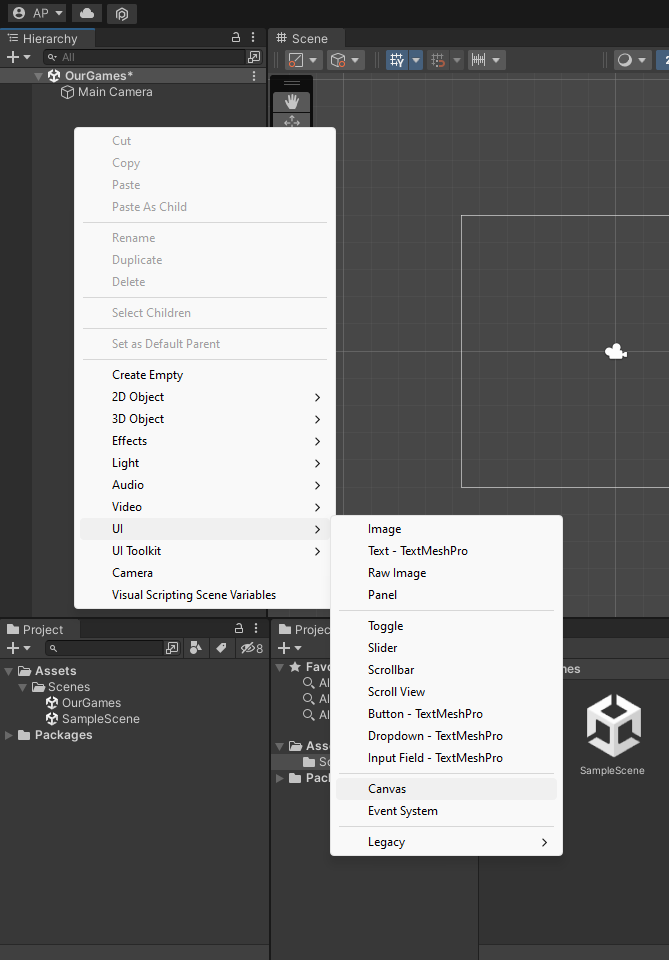
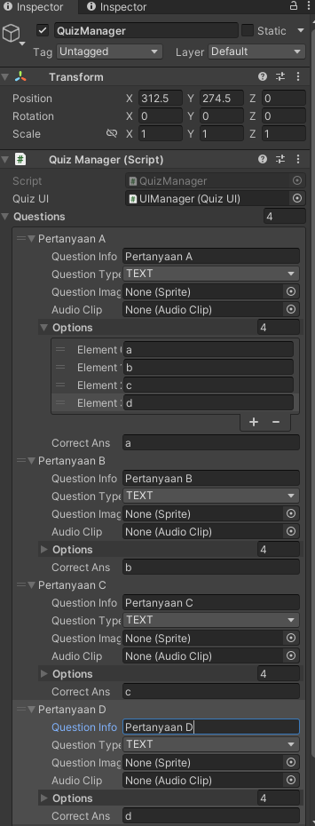

# Modul-Trivia-Quiz-Game

## Trivia Quiz Game Unity Tutorial

## A. Pendahuluan

Unity adalah cross-platform game engine dimana Unity adalah berfungsi sebagai aplikasi "editor" untuk pengembangan game (Semacam halnya Photoshop adalah aplikasi editor untuk manipulasi gambar).

Dalam Unity, dikenal namanya "Unity Project". Unity project secara umunya dibedakan menjadi 2 yaitu Project 3D dan 2D. Dalam modul ini kita akan lebih lanjut membahas membuat game dalam Unity Project 2D.

Contoh Tampilan Project Unity 3D dan 2D:


## B. Setting up Project

1. Buka Unity Hub yang sudah di download terlebih dahulu

2. Pilih New Project pada bagian kanan atas untuk membuat project baru


3. Pilih template 2D sebagai dasar library unity untuk membuat 2D game, isi **Project Name** untuk nama project game yang akan dibuat dan **Location** untuk lokasi tempat penyimpanan pada memory. Jangan lupa memastikan versi editor unity pada bagian atas sudah sesuai.


4. Tekan **Create project** dan menunggu loading dari Unity untuk membuat Project Game 2D baru.


## C. Pengenalan Layout Unity

### Scene View


- `Sceneview` adalah tempat dimana kita berinteraksi dengan *world* atau dunia virtual yang telah kita buat. Di dalam Sceneview kita dapat pilih, memanipulasi, menggerakkan (dan lain sebagainya) Camera, Lighting, dan GameObject lain yang berada di dalam Scene tersebut.    

- Didalam satu project game Unity bisa terdapat beberapa `Scene`. Biasanya jika dalam project game tersebut terdapat sistem Tahapan Level maka 1 level tersebut direpesentasikan dengan 1 Scene. Jika kita ingin membuat Level baru dengan environment dan object yang mungkin berbeda, maka kita akan membuat scene baru. Scene baru juga bisa dibuat untuk membuat main menu, Score Detail Scene dan lain sebagainya. 
### Game View


- `GameView` adalah bentuk rendered dari scene yang telah dibangun dari perspektif camera. Secara singkatnya GameView berfungsi untuk preview bagaimana nantinya game kita jika dimainkan. Dengan GameView, kita bisa test memainkan game yang kita buat sebelum diBuild menjadi game utuh. Untuk menjalankan/test Game melalui GameView kita bisa menggunakan tombol  play berikut:


### Project Window


- `Project Window` adalah window yang menampilkan semua files yang berhubungan dengan project kita. Project Window juga berfungsi untuk navigate dan mengatur/manage asset dan project files dalam suatu project. Semacam File Explorer dalam Windows, kita dapat membuat folder dalam Project Window agar para files bisa tersusun secara rapi (Semua Files yang berada di Project juga bisa diakses/dilihat dari File Explorer Windows).
### Hierarchy


- `Hierarchy` atau `Hierarchy Window` mengandung dan menampilkan semua GameObject yang berhubungan dalam Scene yang sedang dikerjakan. GameObject seperti camera, lighting ,model 3D, dsb yang digunakan dalam Scene pasti akan tertampil dalam Hierarchy.

- Dalam Hierarchy dikenal namanya `Parenting`. 
### Inspector


- `Inspector` befungsi untuk mengatur *properties* dan pengaturan untuk hampir semua yang ada di Unity Editor. Seperti GameObject, Unity Component, Assets, Materials, dan lain sebagainya.
- `GameObject` adalah *base class* dari semua entitas yang berada dalam suatu Scene. Secara umumnya entitas yang berada dalam Scene seperti Camera, Lighting, Player, dan lain-lain base nya adalah GameObject. Dalam contoh Lighting/Light Object merupakan GameObject dengan menambahkan Light `Component` ke GameObject.
- `Component` adalah behaviour dari GameObject. Component yang terdapat di GameObject bisa dilihat di Inspector Window. Transform yang mengatur posisi, scale, dan rotasi suatu object merupakan salah satu Component Object. 

### Toolbar

- 
    
    `Account Drop-down` untuk mengakses Unity Accounts milik kalian.

- 

    Tombol `Unity Cloud` untuk membuka *Unity Service* window.

- 

    `Undo History` untuk melihat, mengulang, dan membatalkan aksi yang telah kalian lakukan pada Editor.

- 

    Tombol `Search` akan membuka Search window yang digunakan pencarian yang lebih advance pada Editor.

- 

    `Layer Drop-down` berguna untuk mengontrol penempatan *GammeObejct* pada `SceneViem`.

- 

    `Layout Drop-down` berguna menyimpan dan mengedit Layout dari Editor kita sesuai dari prefensi masing-masing.

## D. Persiapan Awal dan Pengenalan GameObject

- Terlebih dahulu kita akan mempersiapkan GameObject apa saja yang akan kita buat ke menu Windows Hierarchy yang kurang lebih mirip seperti ini


- Buat GameObject canvas dengan cara klik kanan pada window Hierarchy lalu hover ke UI > dan klik Canvas. (note: akan muncul EventSystem juga)



- lalu kita buat Child dari Canvas yang sebelumnya kita buat dengan cara klik kanan pada saat hover GameObject Canvas lalu pili Create Empty


- buat 2 gameObject dan ubah nama menjadi seperti berikut


- di dalam QuestioInfo buat 2 child GameObject lagi yang diberi nama QuestioText dan ImageHolder, di dalam ImageHolder kita tambahi child GameObject berupa image, klik kanan lalu pilih UI > Image


- `NOTE!` tambahan untuk ImageHolder, kita tambahi child berupa AudioSource denagn cara klik kanan Audio > Audio Source. agar kita bisa membunyikan game kita

- untuk QuestionText, kita pilih menu UI > Text - TextMeshPro

- `Note!` bila muncul pop-up *TMP Importer*, cukup klik *Import TMP Essetials* dan setelah itu close saja.


- di dalam OptionHolder, kita beri 4 button didalamnya dengan cara klik kanan pada OptionHolder lalu pilih UI > Button-TextMeshPro


- beri nama sesui dengan keinginan

- dan terlihat hasil dari Hierarchy kurang lebih seperti ini


- bisa dilihat pada Windows Scene, terlihat berantakan, kita atur sedemikian rupa agar terlihat cukup enak dipandang. kurang lebih seperti ini


## E. Code Part 1 

- setelah itu kita buat script baru untuk menjalankan logic dari game yang akan kita buat.

- pada windows Project, kita buat folder baru dengan nama Scripts dengan cara hober mouse ke windows Project lalu klik kanan, pilih Create > Folder.

- kita masuk ke folder tersebut dan buat C# script dengan cara yang sama seperti yang diatas yaitu hover mouse pada windows Project lalu klik kanan dan pilih Create > C# script, lalu beri nama `QuizManager`

- buat satu lagi Script dan beri nama `QuizUI` untuk mengatur UI/UX game kita

- hasil kurang lebih seperti berikut


- setelah itu kita ingin mengCode isi dari script tersebut dengan cara klik 2 kali pada script tersebut, nanti akan muncul popup pada default IDE yang memunculkan isi dari script yang ada.

- masukan kode ke dalam `QuizManager.cs` sebagai berikut:

```C#
using System.Collections;
using System.Collections.Generic;
using UnityEngine;

public class QuizManager : MonoBehaviour
{
    [SerializeField] private QuizUI quizUI;
    [SerializeField] private List<Question> questions;
    
    //current question data
    private Question selectedQuetion = new Question();

    private void Start() 
    {
        SelectQuestion(); 
    }

    private void SelectQuestion()
    {
        //get the random number
        int val = UnityEngine.Random.Range(0, questions.Count);
        //set the selectedQuetion
        selectedQuetion = questions[val];
        //send the question to quizGameUI
        quizUI.SetQuestion(selectedQuetion);
    }

    public bool Answer(string selectedOption) 
    {
        //set default to false
        bool correct = false;
        //if selected answer is similar to the correctAns
        if (selectedQuetion.correctAns == selectedOption)
        {
            //Yes, Ans is correct
            correct = true;
        }
        else
        {
            //No, Ans is wrong
        }

        Invoke("SelectQuestion", 0.5f);

        //return the value of correct bool
        return correct;
    }

}

//Data  structure for storing the quetions data
[System.Serializable]
public class Question
{
    public string questionInfo;         //question text
    public QuestionType questionType;   //type
    public Sprite questionImage;        //image for Image Type
    public AudioClip audioClip;         //audio for audio type
    public List<string> options;        //options to select
    public string correctAns;           //correct option
}

[System.Serializable]
public enum QuestionType
{
    TEXT,
    IMAGE,
    AUDIO
}
```

- setelah itu kita masukan kode ke dalam `QuizU.cs` sebagai berikut:

```C#
using System.Collections;
using System.Collections.Generic;
using UnityEngine;
using UnityEngine.UI;
using TMPro;

public class QuizUI : MonoBehaviour
{
    [SerializeField] private QuizManager quizManager;               //ref to the QuizManager script
    [SerializeField] private Color correctCol, wrongCol, normalCol; //color of buttons
    [SerializeField] private Image questionImg;                     //image component to show image
    [SerializeField] private AudioSource questionAudio;             //audio source for audio clip
    [SerializeField] private TMP_Text questionInfoText;                 //text to show question
    [SerializeField] private List<Button> options;                  //options button reference

    private float audioLength;          //store audio length
    private Question question;          //store current question data
    private bool answered = false;      //bool to keep track if answered or not

    private void Start() {
        //add the listner to all the buttons
        for (int i = 0; i < options.Count; i++)
        {
            Button localBtn = options[i];
            localBtn.onClick.AddListener(() => OnClick(localBtn));
        }
    }

    public void SetQuestion(Question question)
    {
        //set the question
        this.question = question;
        //check for questionType
        switch (question.questionType)
        {
            case QuestionType.TEXT:
                questionImg.transform.parent.gameObject.SetActive(false);   //deactivate image holder
                break;
            case QuestionType.IMAGE:
                questionImg.transform.parent.gameObject.SetActive(true);    //activate image holder
                questionImg.transform.gameObject.SetActive(true);           //activate questionImg
                questionAudio.transform.gameObject.SetActive(false);        //deactivate questionAudio

                questionImg.sprite = question.questionImage;                //set the image sprite
                break;
            case QuestionType.AUDIO:
                questionImg.transform.gameObject.SetActive(false);          //deactivate questionImg
                questionAudio.transform.gameObject.SetActive(true);         //activate questionAudio
                
                audioLength = question.audioClip.length;                    //set audio clip
                StartCoroutine(PlayAudio());                                //start Coroutine
                break;
        }

        questionInfoText.text = question.questionInfo;                      //set the question text

        //suffle the list of options
        List<string> ansOptions = ShuffleList.ShuffleListItems<string>(question.options);

        //assign options to respective option buttons
        for (int i = 0; i < options.Count; i++)
        {
            //set the child text
            options[i].GetComponentInChildren<TMP_Text>().text = ansOptions[i];
            options[i].name = ansOptions[i];    //set the name of button
            options[i].image.color = normalCol; //set color of button to normal
        }

        answered = false;                       

    }

    /// <summary>
    /// IEnumerator to repeate the audio after some time
    /// </summary>
    /// <returns></returns>
    IEnumerator PlayAudio()
    {
        //if questionType is audio
        if (question.questionType == QuestionType.AUDIO)
        {
            //PlayOneShot
            questionAudio.PlayOneShot(question.audioClip);
            //wait for few seconds
            yield return new WaitForSeconds(audioLength + 0.5f);
            //play again
            StartCoroutine(PlayAudio());
        }
        else //if questionType is not audio
        {
            //stop the Coroutine
            StopCoroutine(PlayAudio());
            //return null
            yield return null;
        }
    }

    /// <summary>
    /// Method assigned to the buttons
    /// </summary>
    /// <param name="btn">ref to the button object</param>
    void OnClick(Button btn)
    {
        
            //if answered is false
            if (!answered)
            {
                //set answered true
                answered = true;
                //get the bool value
                bool val = quizManager.Answer(btn.name);

                //if its true
                if (val)
                {
                    //set color to correct
                    btn.image.color = correctCol;                    
                }
                else
                {
                    //else set it to wrong color
                    btn.image.color = wrongCol;
                }
            }
        
    }
}
```

- kalau sudah selesai, ada beberapa abgian yang masih belum ada, yaitu ShuffleList. kita akan buat ShuffleList tersebut denagn metode yang sama, klik kanan Create > C# script dan beri nama `SuffleList` pastikan tidak ada *typo* dan besar kecilhurf harus sama

- berikut ada lah kode dari `ShuffleList`

```C#
using System.Collections;
using System.Collections.Generic;
using UnityEngine;

public abstract class ShuffleList
{
    public static List<E> ShuffleListItems<E>(List<E> inputList)
    {
        List<E> originalList = new List<E>();
        originalList.AddRange(inputList);
        List<E> randomList = new List<E>();

        System.Random r = new System.Random();
        int randomIndex = 0;
        while (originalList.Count > 0)
        {
            randomIndex = r.Next(0, originalList.Count); //Choose a random object in the list
            randomList.Add(originalList[randomIndex]); //add it to the new, random list
            originalList.RemoveAt(randomIndex); //remove to avoid duplicates
        }

        return randomList; //return the new random list
    }
}
```

- Kembali ke Unity, selanjutnya kita membuat 2 GameObject baru pada Hierarcy yang bukan merupakan Child dari apapun. GameObject tersebut kita beri nama `QuizManager` dan `UIManager`

- setelah itu kita masukan component script pada masing masing GameObject, tambahkan component(script) `QuizManager.cs` pada GameObject `QuizManager`, juga tambahkan component(script) `QuizUI.cs` pada GameObject `UIManager`

- hasil kurang lebih sebagai berikut


- setelah itu pasang reference melalui Inspector pada component yang ada seperti berikut




`Note` : pertanyaan merupakan contoh

### ScriptableObject

- kita akan membuat Scriptable Object agar mempermuda alokasi data pertanyaan yang ada

- buat C# script dengan nama `QuizDataSO` lalu isi code sebagaimana dibawah berikut:

```C#
using System.Collections;
using System.Collections.Generic;
using UnityEngine;

[CreateAssetMenu(fileName = "QuestionsData", menuName = "QuestionsData", order = 1)]
public class QuizDataSO : ScriptableObject
{
    public List<Question> questions;
}
```
- edit script `QuizManager.cs` sebagai berikut

```C#
using System.Collections;
using System.Collections.Generic;
using UnityEngine;

public class QuizManager : MonoBehaviour
{
    [SerializeField] private QuizUI quizUI;
    [SerializeField] private  QuizDataSO quizDataSO;
    private List<Question> questions;
    
    //current question data
    private Question selectedQuetion = new Question();

    private void Start() 
    {
        questions = quizDataSO.questions;
        SelectQuestion(); 
    }

    private void SelectQuestion()
    {
        //get the random number
        int val = UnityEngine.Random.Range(0, questions.Count);
        //set the selectedQuetion
        selectedQuetion = questions[val];
        //send the question to quizGameUI
        quizUI.SetQuestion(selectedQuetion);
    }

    public bool Answer(string selectedOption) 
    {
        //set default to false
        bool correct = false;
        //if selected answer is similar to the correctAns
        if (selectedQuetion.correctAns == selectedOption)
        {
            //Yes, Ans is correct
            correct = true;
        }
        else
        {
            //No, Ans is wrong
        }

        Invoke("SelectQuestion", 0.5f);

        //return the value of correct bool
        return correct;
    }

}

//Data  structure for storing the quetions data
[System.Serializable]
public class Question
{
    public string questionInfo;         //question text
    public QuestionType questionType;   //type
    public Sprite questionImage;        //image for Image Type
    public AudioClip audioClip;         //audio for audio type
    public List<string> options;        //options to select
    public string correctAns;           //correct option
}

[System.Serializable]
public enum QuestionType
{
    TEXT,
    IMAGE,
    AUDIO
}
```
- setelah itu kembali ke Unity dan buat folder baru denagn nama QuestionData, folder ini nanti akan menjadi tempat penyimpanan data quiz-quiz kita.

- lalu buat scriptableObjectnya dengan cara klik kanan Create > QuestionData, akan muncul ScriptableObject sesuai dengan script yang kita buat sebelumnya


- hasilnya seperti berikut


- lalu kita hanya cukup drag and drop ke QuizManager unutk menggunakan pertanyaan dari ScriptableObject


## F. Percantik UI/UX logic (Code part 2)

### MainMenu

- untuk memperindah UI serta UX, kita perlu membuat bagaimana pemain dapat memainkan game kita dengan sesuai serta kita bisa menampakan suatu indikasi tertentu(waktu, score, etc) agar pemain bisa merasakan interaksi mannusia dan gamnya sendiri

- pertama-tama kita buat 2 GameObject  baru child dari `Canvas` yaitu; GameObject kosong `GameMenu` dan GameObject image `MainMenu`

- yang sebelumnya `QuestionInfo` dan `OptionHolder` kita drag ke `GameMenu` sehingga membuat mereka berdua menjadi Child dari `GameMenu`

- hasil akan menjadi seperti berikut


- untuk `MainMenu` kita buat agar gambar  dapat merenggang ke seluruh layar dengan mengubah *Rect Transform* nya


- kita perlu menekan tombol **_ALT_** dan klik pojok kanan bawah (stretch + stretch)


- bisa dilihat maka gambar tersebut akan menutupi keseluruhan layar


- kita beri Child pada MainMenu tersebut berupa UI > TextMesPro dan kita beri nama `TitleText`

- kita set format, penempatan dan warna sesuai dengan keinginan:


- untuk masuk ke Gameplaynya sendiri, kita buat UI > Button-TMP ; disini kita buat 3 dengan nama buttonya; `Biologi`, `Fisika`, `Kimia` (atau terserha mau bagaimana)

- kita set format text dan penempatannya sesuai keinginan, hasil kurang lebih seperti ini


- lalu kita set *Inactive* GameObject `MainMenu`

- kita ingin memberi beberapa logic

### Score, LifePoint & Time

- Kita ingin memberikan suatu logic serta indikasi agar pemain merasa *fun* dalam memainkan game kita. kita beri waktu dan *life point* agar pemain merasa tertantang dan score agar pemain terasa mendapatkan suatu reward/hadiah.

- pertama-tama kita buat GameObject baru yang merupakan Child dari `GameMenu` dengan nama `TopBar`, GameObject yang menyimpan/hold indikasi GameObject lainnya (score, lifepoint, time). lalu kita set posisi dan *rect transform pivotnya* sesuai dengan yang kita harapkan


- di dalam TopBar tersebut kita beri 3 child yang masing merupakan image, kita beri nama; `ScoreHolder`, `LifeHolder`, dan `TimeHolder`.

- kita set bentuk, warna, serta posisi sesuai dengan yang kita inginkan, kurang lebih menjadi seperti berikut


- Di dalam `ScoreHolder` dan `TimeHolder` kita tambah child masing masing yang berupa TextMeshPro untuk memberikan indikasi berapa banya score yang di dapat dan waktu tersisa.

- atur masing-masing format text sesuai kebutuhan, hasil kurang lebih seperti berikut


- Di dalam `LifeHolder` kita beri 3 child berupa image sebagai indikasi jumlah lifepoint

- kita buat 1 GameObject image saja terlebih dahulu dan kita ubah *source image* ke sesuatu yang bebentuk bulat, *knob* misalnya.


- selantjutnya kita hanya cukup Copy Paste GameObject yang sudah kita buat 2 kali, sehingga kita mendapatkan 3 LifePoiint gambar

- kita cukup set posisi dan ukuran sesuai yang kita inginkan, hasil akhir kurang lebih seperti berikut


reference : 
https://www.youtube.com/watch?v=zmL9Cy7iRHY&t=1422s
https://www.youtube.com/watch?v=gq2I020gM2c
https://codeeasy.io/lesson/properties